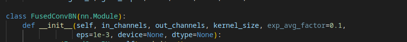

# Smipsons_classification

<h2>Result from kagle</h2>

<h2>The fusing of batch and convolution operations</h2>

The main one aim here is to add batch norm operation to convolution operation 
It's posible with FC lib 

<a href = "https://pytorch.org/tutorials/intermediate/custom_function_conv_bn_tutorial.html">Href to the FC documentation</a>
<h3> FC - it's mean FusedConv</h3>

All, what I need is to add special class into my own code

The new one class also going to use standart convolution arguments

But there are no as aarguments, as padding or starait

<code>
class FusedConvBN(nn.Module):
    def __init__(self, in_channels, out_channels, kernel_size, exp_avg_factor=0.1,
                 eps=1e-3, device=None, dtype=None):
        super(FusedConvBN, self).__init__()
        factory_kwargs = {'device': device, 'dtype': dtype}
        # Conv parameters
        weight_shape = (out_channels, in_channels, kernel_size, kernel_size)
        self.conv_weight = nn.Parameter(torch.empty(*weight_shape, **factory_kwargs))
        # Batch norm parameters
        num_features = out_channels
        self.num_features = num_features
        self.eps = eps
        # Initialize
        self.reset_parameters()

    def forward(self, X):
        return FusedConvBN2DFunction.apply(X, self.conv_weight, self.eps)

    def reset_parameters(self) -> None:
        nn.init.kaiming_uniform_(self.conv_weight, a=math.sqrt(5))
</code>
